# robo2019

<!-- VSCodeでプレビューする場合はCtrl+Kを押してからV -->

ロボカップ用に作ったArduinoライブラリです。名前の由来は、2019年度に入学した人が作ったからです。

## Table of Contents {ignore=true}

<!-- @import "[TOC]" {cmd="toc" depthFrom=2 depthTo=6 orderedList=false} -->

<!-- code_chunk_output -->

- [Machine Info](#machine-info)
- [Usage](#usage)
- [Reference](#reference)

<!-- /code_chunk_output -->

## Machine Info

**機体の構成**

次のようになっていることを想定しています。

各モジュールとメインボード(Arduino Uno)との接続は次の表のようになります。

モジュール名 | 接続方法
:- | -:
OpenMV | I2C (アドレスは`0x12`)
BNO055 | I2C (アドレスは`0x28`)
LCD | I2C (アドレスは`0x27`)
HC-SR04 1 | Digital Pin (Echo=2, Trig=1)
HC-SR04 2 | Digital Pin (Echo=3, Trig=4)
HC-SR04 3 | Digital Pin (Echo=5, Trig=6)
Line Sensor 1 | Analog Pin (1)
Line Sensor 2 | Analog Pin (2)
Line Sensor 3 | Analog Pin (3)
Motor Control Board | SoftwareSerial(12, 13)
kicker | Digital Pin (10)

MCBとモーターの接続ですが、上の写真につけた番号がそのままMCBにつなげたピン番号に対応しています。

**相対座標系**

ロボットの中心を原点とした相対座標系について、極形式の角度は次のようになっているものとします。

この定義は機体の速度ベクトルを設定したり、ボールの方向を取得したりといった場合に使用します。

**OpenMV**

OpenMV内部では`./src/openmv-slave.py`にあるプログラムが動いているものとします。

## Usage

`#include <robo2019.h>`でインクルードしてください。このライブラリが提供するものはすべて`robo`ネームスペースに格納されます。

## Reference

Doxygen用にコメントを入れました。そっちをリファレンスにしてください。あと、`.h`ファイルと`.cpp`ファイルにできるだけ分けるようにしましたが、Arduino IDEのバグで一部リンクができなかったため、そこだけ`.h`内に書いてあります。
